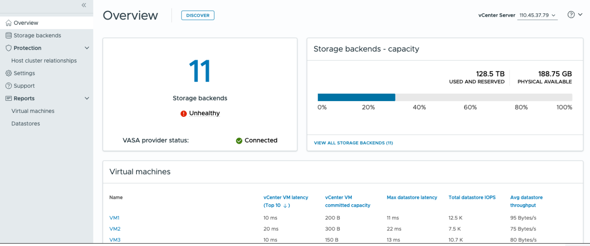

= 适用于VMware vSphere的ONTAP工具信息板概述
:allow-uri-read: 
:icons: font
:imagesdir: ../media/

[role="lead"]
从 vCenter 客户端的快捷方式部分选择适用ONTAP tools for VMware vSphere插件图标即可打开概览页面。此仪表板提供了适用ONTAP tools for VMware vSphere的摘要。

在增强链接模式 (ELM) 中，会出现 vCenter Server 下拉菜单。选择一个 vCenter Server 来查看其数据。该下拉菜单在插件的所有列表视图中均可用。当您在一个页面上选择一个 vCenter Server 时，在插件中切换选项卡时，该 vCenter Server 保持不变。

从概览页面，您可以运行*发现*操作。发现操作检测 vCenter 级别新添加或更新的存储后端、主机、数据存储区以及保护状态或关系。运行按需发现，无需等待计划的发现。

NOTE: 仅当您具有执行发现操作所需的权限时，才会启用“*发现*”操作按钮。

提交发现请求后，您可以在最近任务面板中跟踪操作的进度。

信息板包含多个卡片、用于显示系统的不同元素。下表显示了不同的卡及其所代表的内容。

|===

| *卡* | * 问题描述 * 

| Status | 状态卡可显示存储后端的数量以及存储后端和VASA Provider的整体运行状况。如果所有存储后端状态均正常、则存储后端状态显示*运行状况良好*；如果任一存储后端出现问题(未知/无法访问/降级状态)、则存储后端状态显示*运行状况不正常*。选择工具提示以打开存储后端的状态详细信息。有关详细信息、您可以选择任何存储后端。*其他VASA Provider状态*链接显示已在vCenter Server中注册的VASA Provider的当前状态。 

| 存储后端—容量 | 此卡片显示所选 vCenter Server 实例所有存储后端的已用容量和可用容量汇总。对于ASA r2 存储系统，由于它是分解式系统，因此不显示容量数据。 

| 虚拟机 | 此卡显示按性能指标排序的前10个虚拟机。您可以选择标题、以获取选定指标的前10个VM、这些VM按升序或降序排序。在更改或清除浏览器缓存之前、对卡所做的排序和筛选更改将一直存在。 

| 数据存储库 | 此卡显示按性能指标排序的前10个数据存储库。您可以选择标题以获取选定指标的前10个数据存储库、这些数据存储库按升序或降序排序。在更改或清除浏览器缓存之前、对卡所做的排序和筛选更改将一直存在。有一个数据存储库类型下拉列表可用于选择数据存储库的类型- NFS、VMFS或vols。 

| ESXi主机合规性卡 | 此卡显示所有 ESXi 主机（针对选定的 vCenter）是否遵循按组或类别推荐的NetApp主机设置。您可以选择*应用推荐设置*链接来应用推荐设置。您可以选择主机的合规状态来查看主机列表。 
|===