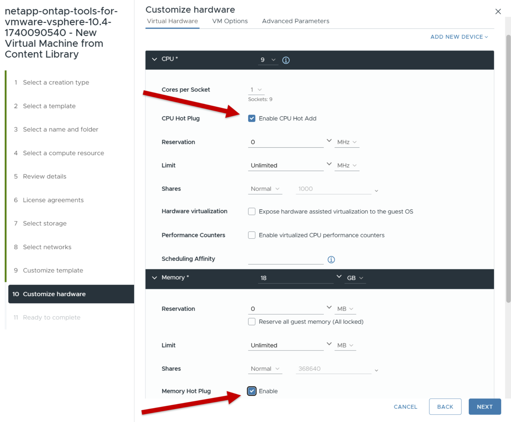

= 部署适用于VMware vSphere的ONTAP工具
:allow-uri-read: 
:icons: font
:imagesdir: ../media/

[role="lead"]
ONTAP tools for VMware vSphere部署为小型单节点，具有核心服务以支持 NFS 和 VMFS 数据存储库。ONTAP部署过程最多可能需要 45 分钟。

.开始之前
如果您正在部署小型单节点，则内容库是可选的。对于多节点或 HA 部署，需要内容库。在 VMware 中，内容库存储 VM 模板、vApp 模板和其他文件。使用内容库进行部署可提供无缝体验，因为它不依赖于网络连接。

创建内容库之前请考虑以下事项：

* 在共享数据存储上创建内容库，以便集群中的所有主机都可以访问它。
* 在部署适用ONTAP tools for VMware vSphere之前设置内容库。
* 确保在为 HA 配置设备之前创建内容库。
+

NOTE: 部署后不要删除内容库中的OVA模板。

NOTE: 为了将来启用 HA 部署，请避免直接在 ESXi 主机上部署ONTAP工具虚拟机。相反，将其部署在 ESXi 主机集群或资源池中。

请按照以下步骤创建内容库：

. 从下载包含ONTAP tools for VMware vSphere的二进制文件 (_.ova_) 和签名证书的文件 https://mysupport.netapp.com/site/products/all/details/otv10/downloads-tab["NetApp 支持站点"^] 。
. 登录到vSphere Client
. 选择vSphere客户端菜单并选择*内容库*。
. 选择页面右侧的*创建*。
. 提供库的名称并创建内容库。
. 转到您创建的内容库。
. 选择页面右侧的*Actions*并选择*Import Item*并导入OVA文件。

NOTE: 有关详细信息、请参见 https://blogs.vmware.com/vsphere/2020/01/creating-and-using-content-library.html["创建和使用内容库"]博客。

NOTE: 在继续部署之前，请将清单上的集群分布式资源调度程序 (DRS) 设置为“保守”。这可确保虚拟机在安装期间不会被迁移。

ONTAP tools for VMware vSphere最初部署为非 HA 设置。要扩展至高可用性部署，您需要启用 CPU 热插拔和内存热插拔。您可以在部署过程中执行此步骤，也可以在部署后编辑虚拟机设置。

.步骤
. 从下载包含ONTAP tools for VMware vSphere的二进制文件 (_.ova_) 和签名证书的文件 https://mysupport.netapp.com/site/products/all/details/otv10/downloads-tab["NetApp 支持站点"^] 。如果您已经将OVA导入内容库，则可以跳过此步骤，继续下一步。
. 登录到vSphere服务器。
. 转到您打算部署 OVA 的资源池、集群或主机。
+

NOTE: 切勿将适用于VMware vSphere虚拟机的ONTAP工具存储在其管理的vvol数据存储库中。

. 您可以从内容库或本地系统部署OVA。
+
|===

| 从本地系统 | 从内容库 

| a.右键单击并选择*部署OVF模板...*。b.从URL中选择OVA文件或浏览到其位置，然后选择*下一步*。 | a.转到您的内容库并选择要部署的库项目。b.选择*操作*>*从此模板中新建虚拟机* 
|===
. 在*选择名称和文件夹*字段中，输入虚拟机名称并选择其位置。
+
** 如果您使用的是vCenter 8.0.3版本，请选择*自定义此虚拟机的硬件*选项，此选项将激活名为*自定义硬件*的附加步骤，然后再进入*准备完成*窗口。
** 如果您使用的是 vCenter Server 7.0.3 版本，请按照部署结束时的*下一步是什么？*部分中的步骤进行操作。image:../media/select-name.png["选择名称和文件夹"]

. 选择计算机资源，然后选择*Next*。(可选)选中*自动启动已部署的VM*复选框。
. 查看模板的详细信息，然后选择*Next*。
. 阅读并接受许可协议，然后选择*Next*。
. 为配置和磁盘格式选择存储，然后选择*Next*。
. 为每个源网络选择目标网络，然后选择*Next*。
. 在*自定义模板*窗口中，填写必填字段并选择*下一步*。image:../media/sys-conf.png["自定义模板"]
+
** 该信息在安装期间进行验证。如果存在差异，Web 控制台上会出现一条错误消息，并提示您进行更正。
** 主机名必须包含字母(A-Z、a-z)、数字(0-9)和连字符(-)。要配置双堆栈、请指定映射到IPv6地址的主机名。
+

NOTE: 不支持纯IPv6。包含IPv6和IPv4地址的VLAN支持混合模式。

** ONTAP工具IP地址是与ONTAP工具通信的主要接口。
** IPv4是节点配置的IP地址组件、可用于在节点上启用诊断Shell和SSH访问、以便进行调试和维护。

. 使用 vCenter Server 8.0.3 版本时，在 *自定义硬件* 窗口中，启用 *CPU 热添加* 和 *内存热插拔* 选项以允许 HA 功能。image:../media/customize-hw105.png["定制硬件"] 
. 查看*Ready to Complete*(准备完成*)窗口中的详细信息，选择*Complete*(完成*)。
+
创建部署任务后、vSphere任务栏中将显示进度。

. 如果未选择自动启动虚拟机的选项、请在完成任务后启动虚拟机。

您可以在VM的Web控制台中跟踪安装进度。

如果 OVF 表格存在差异，则会出现一个对话框提示采取纠正措施。使用标签按钮进行导航，进行必要的更改，然后选择*确定*。您有三次机会来解决任何问题。如果三次尝试后问题仍然存在，安装过程将停止，建议在新的虚拟机上重新尝试安装。

.下一步是什么？
如果您已将适用于VMware vSphere的ONTAP工具部署到vCenter Server 7..3中、请在部署后按照以下步骤进行操作。

. 登录到vCenter Client
. 关闭ONTAP工具节点。
. 转到*库存*下的ONTAP tools for VMware vSphere并选择*编辑设置*选项。
. 在*CPU*选项下，选中*Enable CPU Hot add*复选框
. 在*内存*选项下，选中*内存热插拔*旁边的*启用*复选框。

