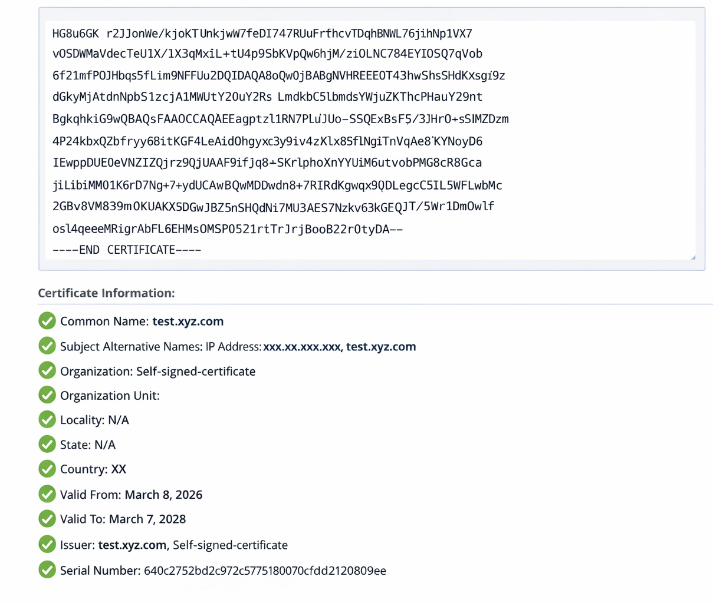

= 更改 ONTAP tools 中的证书验证标志
:allow-uri-read: 
:icons: font
:imagesdir: ../media/

[role="lead"]
默认情况下，为 ONTAP 存储后端证书启用证书验证。如果需要，可以将证书验证标志设置为 false 以绕过 SAN 证书检查。此设置不适用于 vCenter 服务器证书。

.开始之前
您需要维护用户凭据。

.步骤
. 登录到 vCenter 服务器。
. 找到 ONTAP tools 虚拟机并启动 Web 控制台。
. 使用 `maint`凭据登录。
. 进入 `1`选择“应用程序配置”菜单。
. 输入 `3`以更改证书验证标志。
+
维护控制台显示证书验证标志状态并提示您进行更改。

. 输入“y”切换标志或输入“n”取消。

启用证书验证后，ONTAP tools 会检查所有存储后端是否使用具有使用者备用名称 (SAN) 的证书。如果任何存储后端使用没有 SAN 的证书，则无法启用验证。在启用此标志之前，请验证所有存储后端是否都使用基于 SAN 的证书。如果禁用该标志，ONTAP tools 将绕过所有已配置的存储后端的证书验证。

[[verify-san-based-certificates-for-storage-backends]]
== 验证存储后端的基于 SAN 的证书

为确保安全通信和正确验证，请验证所有存储后端都使用基于 SAN 的证书：

. 请检查 ONTAP 管理证书是否包含使用者备用名称 (SAN) 条目。
. 确认 SAN 条目与 ONTAP 管理 IP 地址或 DNS 名称或两者匹配。
. 确保用于载入 ONTAP 的详细信息与证书 SAN 条目中的 IP 地址或 DNS 名称匹配。

这些步骤有助于防止证书验证问题，并保持 ONTAP 系统的安全集成。

以下证书示例显示了已解码的信息：

