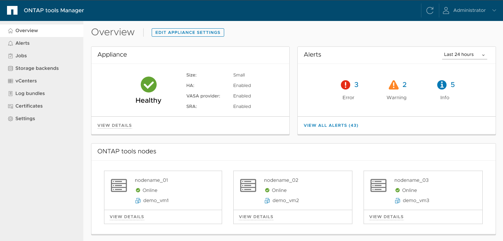

= ONTAP工具管理器用户界面
:allow-uri-read: 
:icons: font
:imagesdir: ../media/

[role="lead"]
ONTAP tools for VMware vSphere支持多租户，可管理多个 vCenter Server 实例。

ONTAP工具管理器是一个基于 Web 的控制台，用于管理ONTAP tools for VMware vSphere。

ONTAP工具管理器提供以下功能：

* 管理警报 - 查看和过滤由ONTAP tools for VMware vSphere生成的警报。
* 管理存储后端 - 添加和管理ONTAP存储集群，并将其全局映射到 vCenter Server 实例。
* 管理 vCenter Server 实例 - 在ONTAP工具中添加和管理 vCenter Server 实例。
* 监控作业 - 监控和调试从ONTAP工具插件界面和ONTAP工具管理器界面启动的异步作业。您可以按时间段过滤作业、调整页面大小并查看作业详细信息，包括错误和子任务。单击失败状态可查看错误详细信息。对于具有子任务的作业，展开行以查看描述和状态。对于子作业，使用作业的下钻来查看详细信息。
* 下载日志包 - 收集日志文件以排除ONTAP tools for VMware vSphere故障。
* 管理证书 - 用自定义 CA 证书替换自签名证书，并续订或刷新 VASA Provider 和ONTAP工具的证书。
* 重置密码 - 更改 VASA 提供程序和 SRA 的密码。
* 管理设备设置 - 配置ONTAP工具设备，包括启用 HA 和扩大节点大小。

要访问ONTAP工具管理器、请 `\https://<ONTAPtoolsIP>:8443/virtualization/ui/`从浏览器启动、然后使用您在部署期间提供的适用于VMware vSphere的ONTAP工具管理员凭据登录。

|===
| *卡* | * 问题描述 * 

| 设备卡 | 设备卡显示ONTAP工具设备的整体状态、配置详细信息以及已启用服务的状态。要查看更多信息，请选择“查看详细信息”链接。如果您更改设备设置，卡片将显示作业状态和详细信息，直到更改完成。 

| 警报卡 | 警报卡显示按类型分类的ONTAP工具警报，包括 HA 节点级警报。您可以通过单击计数超链接来查看详细警报，该超链接将带您进入按所选警报类型过滤的警报页面。 

| vCenters 卡 | vCenters 卡显示由ONTAP工具管理的所有 vCenter Server 实例的健康状况。您可以通过选择相应的链接来查看每个 vCenter 的详细信息，该链接将导航到包含有关所选实例的更多信息的页面。 

| 存储后端卡 | 存储后端卡显示ONTAP工具中配置的所有ONTAP存储集群的健康和连接状态。您可以通过选择相应的链接来查看每个存储后端的详细信息，该链接将导航到包含有关所选集群的更多信息的页面。 

| ONTAP工具节点卡 | ONTAP工具节点卡显示设备中的所有节点，包括节点名称、虚拟机名称、状态和网络信息。选择“查看详细信息”以查看特定节点的更多详细信息。 [注意] 在非 HA 配置中，仅出现一个节点。在 HA 配置中，显示三个节点。 
|===